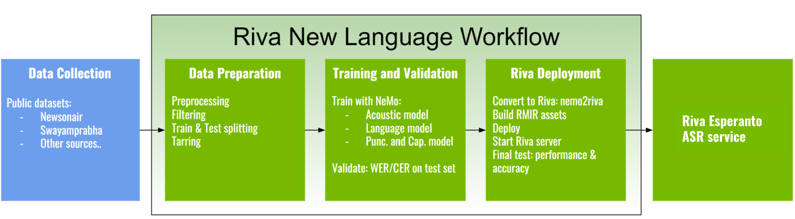

# The Making of Riva Esperanto ASR Service

This tutorial walks you through step-by-step how to develop the Riva Esperanto Automatic Speech Recognition (ASR) service, from raw transcribed audio data to a ready-to-serve Riva ASR service.

## Overview

The following diagram provides a high-level overview of the end-to-end engineering workflow required to realize the Riva Esperanto ASR service.

The Riva new language workflow is divided into three major stages:
- Data preparation
- Training and validation
- Riva deployment

Except for Riva deployment, all stages are carried out in the [NeMo toolkit](https://github.com/NVIDIA/NeMo).

There is an extended [example](https://github.com/NVIDIA/NeMo/blob/main/docs/source/asr/examples/esperanto_asr/esperanto_asr.rst)
for obtaining an Esperanto ASR model (Conformer-CTC) from scratch in NeMo. We recommend you use this example for the first two stages of the Riva new language workflow.

## Riva deployment

With all the models trained, it's the time to deploy the Riva service.

### Esperanto model

Now that you've completed training the `.nemo` models, perform the following steps to deploy these models on Riva:

- Refer to the [instructions](https://docs.nvidia.com/nim/riva/asr/latest/custom-deployment.html#deploying-custom-models-as-nim)), which provides a `nemo2riva` conversion tool to convert .nemo model to .riva format needed to deploy a custom model. Once the .riva file is ready, respective NIM container can be used to build and deploy the model.

After the server successfully starts, query the service to measure the accuracy, latency, and throughput.

### NeMo pretrained Esperanto model on NGC

You can use the NGC pretrained Esperanto model as a starting point for your development:

- Conformer-CTC ASR Esperanto [NeMo version (.nemo format)](https://catalog.ngc.nvidia.com/orgs/nvidia/teams/nemo/models/stt_eo_conformer_ctc_large)

# Conclusion

In this tutorial, we have guided you through the steps that are needed to realize the Riva Esperanto ASR service, from raw data to a ready-to-use service.

You can follow the same process to setup a whole new Esperanto ASR service using your own data, or use the resources herein to fine-tune parts of the pipeline with your own model and data.
