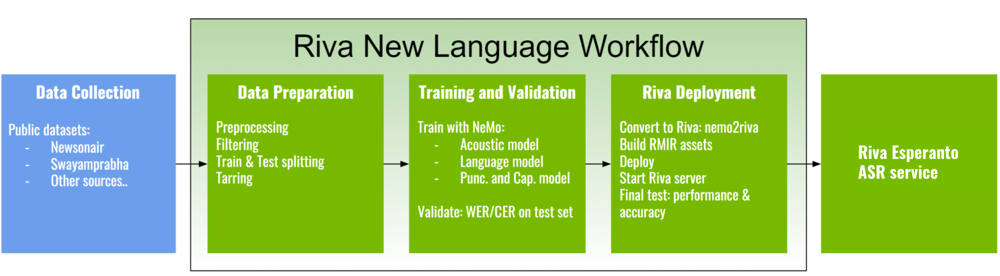

# The Making of RIVA Esperanto ASR Service

This tutorial walks you through the step-by-step, end-to-end process that NVIDIA engineers and data scientists employed to develop the Riva Esperanto Automatic Speech Recognition (ASR) service, from raw transcribed audio data to a ready-to-serve Riva ASR service.

## Overview

The below diagram provides a high-level overview of the end-to-end engineering workflow required to realize the Riva Esperanto ASR service.

The Riva new language workflow is divided into 3 major stages:
- Data preparation
- Training and validation
- Riva deployment

All stages except for the last "Riva deployment" are carried out in the [NeMo](https://github.com/NVIDIA/NeMo) toolkit.

There is an extended [example](https://github.com/NVIDIA/NeMo/blob/main/docs/source/asr/examples/esperanto_asr/esperanto_asr.rst)
for obtaining an Esperanto ASR model (Conformer-CTC) from scratch in NeMo. We recommend use this example for first two stages of The Riva new language workflow.

## Riva deployment

With all the models trained, now it's the time to deploy the Riva service.

### Esperanto model

Given the final `.nemo` models that you have trained upon completing the previous training step, here are the steps that need to be done to deploy on Riva:

- Download RIVA Quickstart scripts (see [instructions](https://docs.nvidia.com/deeplearning/riva/user-guide/docs/quick-start-guide.html#local-deployment-using-quick-start-scripts)) – it provides `nemo2riva` conversion tool, and scripts (`riva_init.sh`, `riva_start.sh` and `riva_start_client.sh`) to download the `servicemaker`, `riva-speech-server` and `riva-speech-client` Docker images.

- Build `.riva` assets: using `nemo2riva` command in the `servicemaker` container.

- Build `RMIR` assets: use the `riva-build` tool in the `servicemaker` container. See examples of build commands for different models and for offline and online ASR pipelines in the [Riva build documentation page](https://docs.nvidia.com/deeplearning/riva/user-guide/docs/asr/asr-customizing.html).

- Deploy the model in `.rmir` format with `riva-deploy`.

- Start the server with `riva-start.sh`.

After the server successfully starts up, you can query the service, measuring accuracy, latency and throughput.

### NeMo pretrained Esperanto model on NGC

You can use the NGC pretrained Esperanto model as starting point for your development.

**Acoustic model**:

- Conformer-CTC ASR Esperanto [NeMo version (.nemo format)](https://catalog.ngc.nvidia.com/orgs/nvidia/teams/nemo/models/stt_eo_conformer_ctc_large)

# Conclusion

In this tutorial, we have guided you through the steps that are needed to realize the Riva Esperanto ASR service, from raw data to a ready-to-use service.

You can follow the same process to setup a whole new Esperanto ASR service using your own data, or use the resources herein to fine-tune parts of the pipeline with your own model and data.
