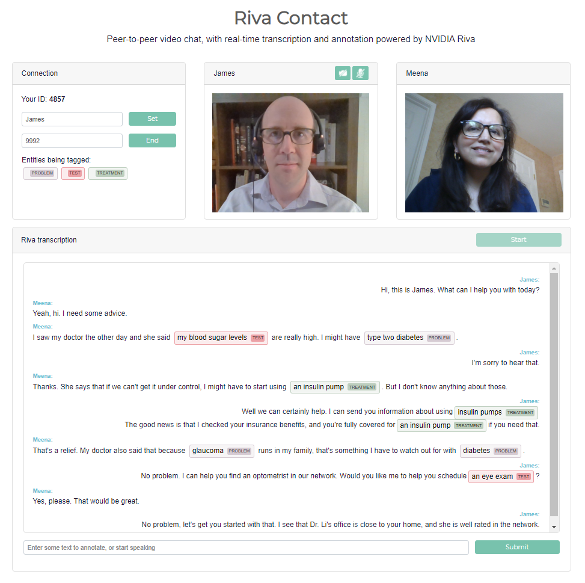

# Riva Contact

Riva Contact is a web-based demonstration app for contact center applications, combining peer-to-peer video chat with streaming automatic speech recognition (ASR) and natural language processing (NLP). It is a lightweight Node.js application, backed by robust NVIDIA Riva AI Services.



Please find more information about the Riva Contact application in the [Riva documentation](http://docs.riva-ai.nvidia.com/latest/samples/callcenter.html).

## Requirements

Riva Contact is a Node.js application, intended to run in a Linux environment. It requires Riva Speech Services to run with two primary models:

* Streaming ASR
* Named Entity Recognition (NER)

You can use the default Riva models offered in the Quick Start configuration, or you can deploy your own custom models trained using [NVIDIA TAO Toolkit](https://developer.nvidia.com/tao-toolkit) and import into Riva. Riva Contact comes pre-configured to use the models from the Riva [Quick Start Guide](https://docs.nvidia.com/deeplearning/riva/user-guide/docs/quick-start-guide.html).

## Installing the app

From the top of the [https://github.com/nvidia-riva/samples](https://github.com/nvidia-riva/samples) repo:

```bash
cd apps/riva-contact
npm install
```

Riva Contact uses environment variables to manage its configuration parameters. These are kept in the config file [env.txt](./env.txt), where you will want to set the URL of your running Riva AI Services. You may also want to change the application’s ports, or the name of the NER model if you’ve deployed your own custom model in Riva.

Depending on your server environment, you will likely also need to open two ports on the server (by default, ports 8009 and 9000). These ports are for the main entry point to the web application, and for the PeerJS server which helps to negotiate the peer-to-peer chat connections. You may also need to set up port forwarding for these in your router, if applicable.

## Running the Service
```
npm run start
```

This will start the Node.js application and will start listening for connections.

## Using the Service
1. Load the URL in a browser (Chrome or Firefox work well) on a computer with a webcam and microphone. For best ASR results, a headset is recommended.
For example, if you’re accessing the service from a computer within the local network, and it’s hosted on a machine with the IP 192.168.2.10, then the URL would be https://192.168.2.10:8009/.
The application includes a self-signed certificate for demo purposes which is likely to cause the browser to indicate a security warning. You can see the certificate in riva-contact/certificates. To remove this warning, you can generate your own or buy one from a trusted signing authority. You can “accept the risk” and continue.

2. When asked, give the website permission to access your webcam and microphone. After the page is loaded, you’re welcome to start the Riva transcription without needing to make a video call.

3. In the box titled Riva transcription, hit the Start button, then start speaking. You’ll see in-progress transcripts in the text field at the bottom. As those transcripts are finalized, they’ll appear with NLP annotations in the transcription box. To test the NLP directly (without speaking), simply type into the text field at the bottom and hit Submit.
To call someone, you’ll need their ID. Yours is the 4-digit number in the Connection box. It’s random, and it changes every time the page is reloaded. Enter the ID of the person you want to call, and click Call. They will get a notification that a call is incoming, and will be asked to accept. After you’re connected, Riva transcription will start automatically if it’s not already running.
The transcripts for each speaker are marked with the user’s ID, or their display name if it has been set in the Connection box.

4. To end the call, simply click the End button.